STUDENTS raport
================
Natalia Kozlowska
10 10 2021

-----

## INTRODUCTION

We often wonder what may actually affect the outcome of final school
exams. As a rule, we come to the conclusion that one of the aspects that
may significantly affect the assessment is primarily the time spent on
learning. And it certainly is, in a way, a good lead for our search.
However, I was wondering if something else, not strictly related to
science, could contribute to obtaining, at least a few additional points
for the test.

It seems to me that the data analysis from
[Kaggle](https://www.kaggle.com/spscientist/students-performance-in-exams)
may at least in some way answer my question. It contains 10 unique items
from which we can find out not only what results were obtained by
individual students from the three final exams (writing, reading and
math) but also which students used the option of financing lunches, or
what education their parents have.

Answering the question about what other factors may have directly or
indirectly influenced the final result of the exams at school, I will
focus mainly on those on which the student has no greater influence,
such as the above-mentioned education of parents or, for example,
belonging to a particular ethnic group . Can analyzing these variables,
at least to some extent, answer the question of whether the variables
that are not directly influenced by the student can, to some extent,
affect the results of the final exams?

If you are interested in what conclusions you came to when analyzing
this data, I invite you to read it\!

-----

### But first, median

At the beginning of the analysis, we will focus on what we are most
interested in, i.e. the final exam results. Perhaps already at this
stage, we will be able to answer some important questions, such as
*which test went best for students? *, or *did the results of one of the
three exact-subject tests differ significantly from the rest? *.

I would like to emphasize that in this particular case, instead of the
average, I will use the median to describe our exam results. This is
because the distribution of all test results is left diagonal.

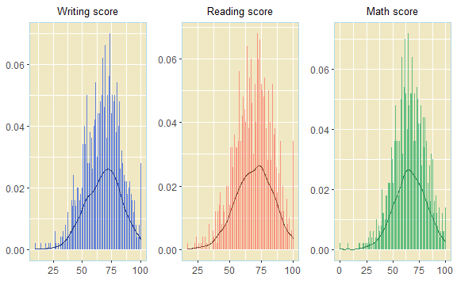

 

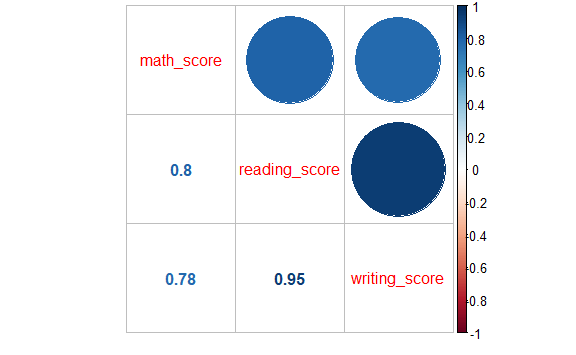

### Women rules

Let us consider for a moment whether the back could somehow
significantly affect the results of the final study? It is not known
that, according to the rules of women better in the humanities, for men
they achieve better results in science. Can we expect any results from
this data? To find out about it, we will analyze the charts below.

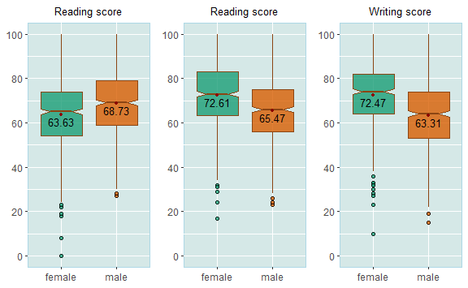

Let’s also compare the overall averages of all three exams for both
sexes.

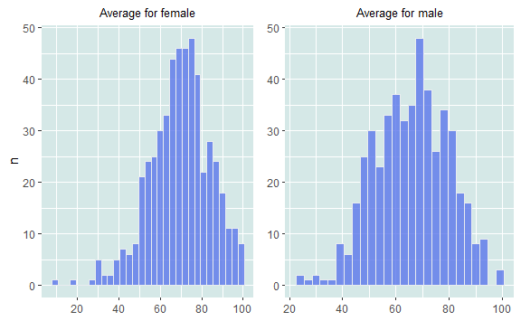

What is interesting in the charts above? The fact is that women,
compared to men, coped with the exams much better. However, it was also
among women that the lowest marks appeared (the average of all three
exams in this group was only 9 points\!), And among men the result was
over 200% higher (23 points). So we can say that taking into account
women in general, they were definitely better than men, but in a
situation in which we analyze individual cases, we notice that it was
men who passed the exams better, and they certainly did not do worse
than women.

Let’s check the overall statistics for both sexes. In this case, I take
into account the average of all three exams, due to the normal
distribution of this variable.

| Gender | Min.  | 1st Qu. | Median | Mean  | 3rd Qu. |  Max.  |
| :----: | :---: | :-----: | :----: | :---: | :-----: | :----: |
| female | 9.00  |  60.67  | 70.33  | 69.57 |  78.67  | 100.00 |
|  male  | 23.00 |  56.00  | 66.33  | 65.84 |  76.25  | 100.00 |

After a preliminary analysis of the charts and general statistics, we
can now come to some interesting conclusions. Women generally fared
better on the tests. What should be noted is that our preliminary
hypothesis that men might do better in math exams was true\! Women were,
on average, 5 points worse than men. However, I would like to emphasize
that the difference is not that big, especially if we compare the next
two exams with each other. The chart below will definitely help us
analyze this problem.

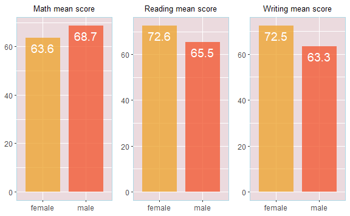

Only 178 men wrote below her average of 65 points, but as many as 236
women below her average of 68 points.

Since we analyzed the lowest scores in the exams, let’s check which
group fared better in terms of the number of maximum points scored.

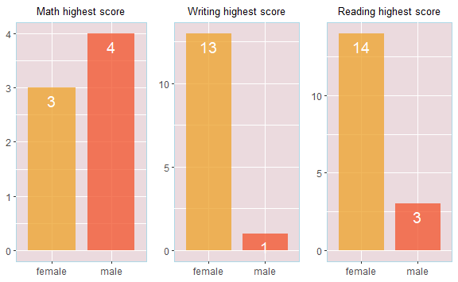

In the case of the type of case, the differences are really noticeable
and as we can see, women in practically each of the exams scored more
points. Let’s see if there is any significant difference between the
women who wrote the test best and those who wrote it the worst.

-----

HIGHEST AVERAGE (over 97 points) FROM THREE EXAMS AMONG WOMEN

| race    | parental\_education | lunch        | test\_preparation | math\_score | reading\_score | writing\_score |
| :------ | :------------------ | :----------- | :---------------- | ----------: | -------------: | -------------: |
| group E | bachelors degree    | standard     | completed         |          99 |            100 |            100 |
| group C | bachelors degree    | standard     | completed         |          96 |            100 |            100 |
| group D | some high school    | standard     | completed         |          97 |            100 |            100 |
| group E | bachelors degree    | standard     | none              |         100 |            100 |            100 |
| group E | bachelors degree    | free/reduced | completed         |          92 |            100 |            100 |
| group E | masters degree      | standard     | completed         |          94 |             99 |            100 |
| group D | some college        | standard     | none              |          98 |            100 |             99 |
| group D | bachelors degree    | free/reduced | completed         |          93 |            100 |            100 |
| group D | masters degree      | standard     | none              |          92 |            100 |            100 |
| group E | associates degree   | standard     | none              |         100 |            100 |            100 |

-----

LOWEST AVERAGE (less than 20 points) OF THREE EXAMS AMONG WOMEN

| race    | parental\_education | lunch        | test\_preparation | math\_score | reading\_score | writing\_score |
| :------ | :------------------ | :----------- | :---------------- | ----------: | -------------: | -------------: |
| group C | some high school    | free/reduced | none              |           0 |             17 |             10 |
| group B | high school         | free/reduced | none              |           8 |             24 |             23 |

For women who obtained the highest scores and graduated from school with
an average of over 97 points, most of them passed complete tests, and
only two out of ten benefited from lunches. One thing that is obvious is
that among the best pupils we will not find anyone from the B and C
group, and these races are among the worst results.

As we can see, the women who obtained the lowest exam results are
additionally characterized by the fact that none of them passed the test
completely. Additionally, each of them used the option to subsidize the
dinner. It should also be noted that parents of persons with the lowest
average did not have higher education.

Let’s check what the situation looks like among men.

 

-----

HIGHEST AVERAGE (over 97 points) FROM THREE EXAMS AMONG MEN

| race    | parental\_education | lunch        | test\_preparation | math\_score | reading\_score | writing\_score |
| :------ | :------------------ | :----------- | :---------------- | ----------: | -------------: | -------------: |
| group E | associates degree   | free/reduced | completed         |         100 |            100 |             93 |
| group D | some college        | standard     | completed         |         100 |             97 |             99 |
| group E | bachelors degree    | standard     | completed         |         100 |            100 |            100 |

-----

LOWEST AVERAGE (less than 25 points) FROM THREE EXAMS AMONG MEN

| race    | parental\_education | lunch        | test\_preparation | math\_score | reading\_score | writing\_score |
| :------ | :------------------ | :----------- | :---------------- | ----------: | -------------: | -------------: |
| group A | some college        | free/reduced | none              |          28 |             23 |             19 |
| group B | high school         | free/reduced | none              |          30 |             24 |             15 |

Although, as we can see, this group is not as numerous as that of women,
this and on the basis of this we can draw some conclusions and notice
significant differences between the two groups. Men with the highest
average, like women, have well-educated parents. Additionally, each of
them passed a complete test. And only one in three benefited from food
subsidies. Interestingly, each of them obtained a set of points from the
math exam. When it comes to the group with the lowest scores, we’ll
notice for sure that none of these people failed the competent test and
all of them benefited from a lunch refund.

We can certainly state now that not only the back can have a significant
impact on the final results of the examinations. Both whether lunch was
reimbursed and the education and training of the parents may also
contribute to the results obtained.

### Tell me, where are you from?

Let’s think about, for example, the distribution of exam results, due to
the differentiation of all ethnic groups?

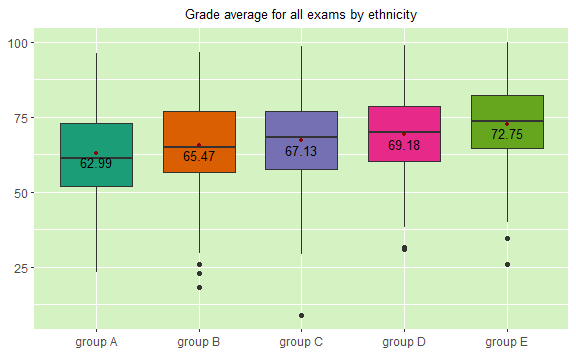

 

As we can see, group E did the best in the exam. However, let us note
that in this particular case we took into account the average of all
three exams\! Let’s check if any of the groups differs in any particular
way when it comes to the result of each of the exams separately.

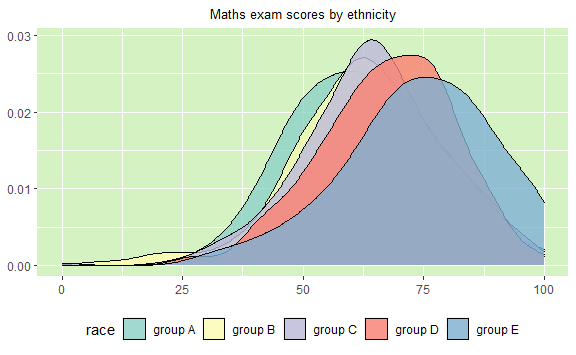

 

If we were to compare the results of all three tests, we would conclude
that there is no major difference between the groups. However, by
analyzing the density plots, I wanted to carefully analyze the math test
results for each ethnic group. As we already know, the test result is
mainly influenced by whether the test was complete and whether the
student used the lunch option. I decided to check and calculate the
percentage of presence of each of this variable. However, I focused only
on three groups, which to a large extent stand out from the rest.

|  Race   | Gender - female | Lunch - free |
| :-----: | :-------------: | :----------: |
| group A |       40%       |     40%      |
| group B |       57%       |     36%      |
| group E |       49%       |     29%      |

As we can see, the group that scored the best in math has the lowest
percentage of people who used the free lunches option. On the other
hand, group B, which has a large ‘tail’ on the left side, also has the
largest number of women who belong to this group. As you can see, by
analyzing one graph, we can easily explain some dependencies.

Since we know what the average of all three exams looks like, then let’s
check how each group did on each of the exams separately.

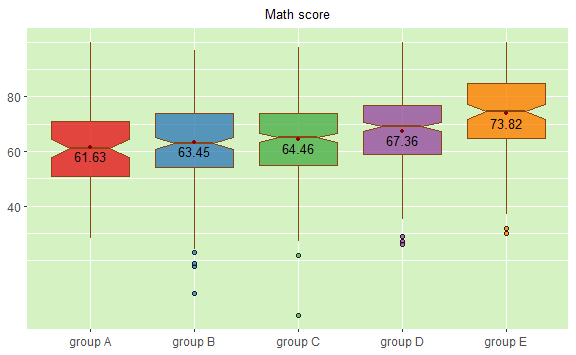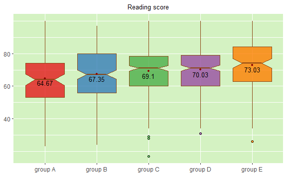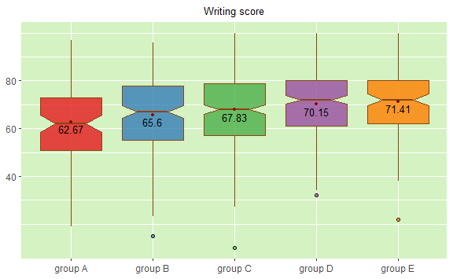

 

It is certainly noticeable that group E dominates other groups when it
comes to the mean. On the other hand, group A is the worst in the list.

 

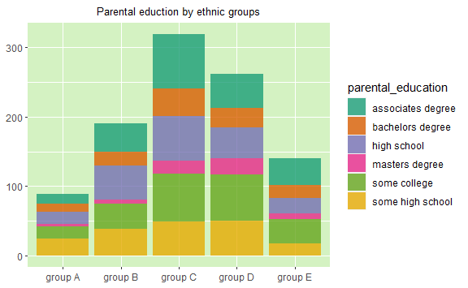

 

Let us note that in group B there is the greatest response from parents
with secondary education, which may also, in a sense, explain the
results of the math test that I analyzed earlier.

### Parental generation

Let us put the topic of gender and ethnic groups aside. We know that
both of these variables could have significantly influenced the results
of final exams in students, so let’s check if the same applies to
parents’ education. In a sense, we have already answered this question
by analyzing and comparing the students who received the highest and the
lowest averages. We could have made a certain hypothesis that the higher
the parents’ education, the higher the student’s score. Let’s check
carefully if this can really be the case.

At the beginning, let’s check which education occurs most often among
the parents of students.

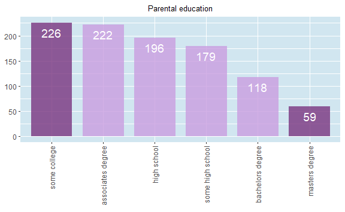

 

Now let’s check what the mean distribution of all three exams looked
like, taking into account the parents’ education.

 

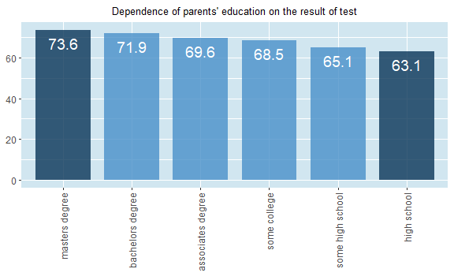

As we can see, the difference between the average of all three exams
between the highest (master’s degree) and the lowest (high school) is
10.5 points\! Let’s consider if something could be causing such a large
difference between these extreme results. Since we know that it is women
who usually fared better in most of the exams, let’s check the gender
distribution due to the education of their parents.

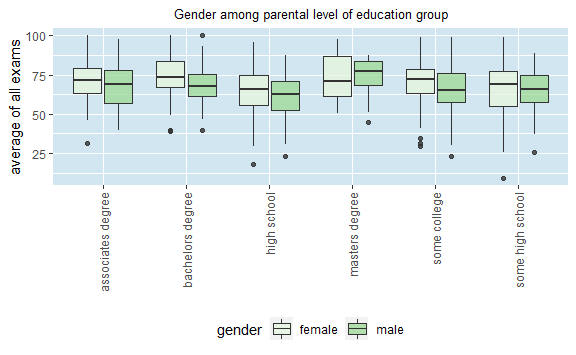

We can see, the number of women in each of these groups is greater than
the number of men.

Do you remember what the overall results were for each ethnic group? It
turned out that group A was the lowest and the weakest of all five
groups. It is worth noting that this group is the least common in the
masters degree. Perhaps this is the reason for such high results in the
rankings of this group.

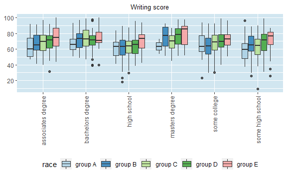

### Mission completed

Whether or not someone completed the test had a very important direct or
indirect influence on the final result of the exams. As it turned out so
far, if someone failed to pass the test, they might have less chance of
getting a high score. Let’s check what exactly is characterized by this
variable. Let’s start with its quantitative distribution.

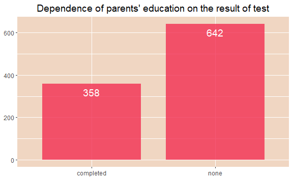

Only just over 38% passed the full test. Let’s check if the completeness
of the test had a real impact on the final result of the exam. Only just
over 38% rejected the full test. Let’s check if the completeness of the
test had a real impact on the final result of the exam.

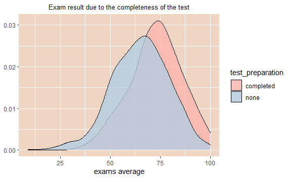

As you can see, whether someone failed the complete test significantly
influenced the final result. In the chart above, you can see quite a lot
of difference between the two groups. And I do it with the numbers?

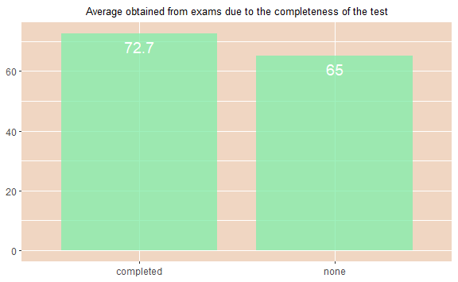

Differs the mean of all three tests to more than 7 points. It seems like
quite a lot. So in the exam, you can turn strategies to complete the
test, whether or not you are sure of your answer, there is a good chance
that we will increase our chances of getting higher scores\!

Let’s also check how the students gave the tests due to the education of
their parents.

| Parental education | Complete |  None  |
| :----------------: | :------: | :----: |
| associates degree  |  36.94%  | 63.06% |
|  bachelors degree  |  38.98%  | 61.02% |
|    high school     |  28.57%  | 71.43% |
|   masters degree   |  33.90%  | 66.10% |
|    some college    |  34.07%  | 65.93% |
|  some high school  |  43.02%  | 56.98% |

And what about ethnicity?

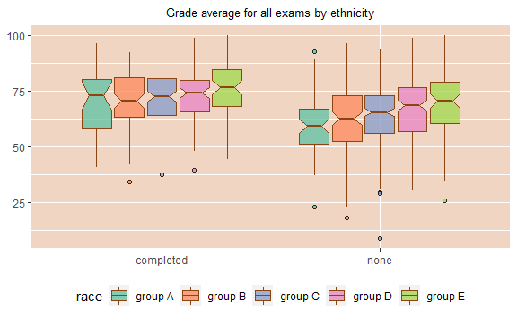

 

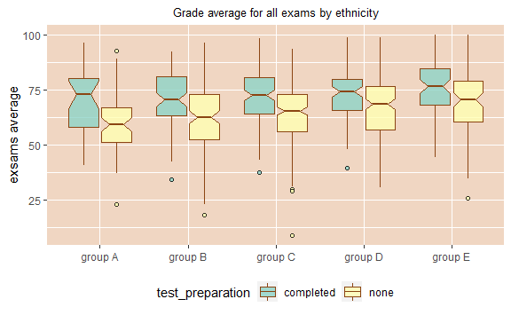

-----

## Summary

Of course, on the basis of the above analysis, we are able to come to
very interesting and significant conclusions. However, before going to
them, I wanted to know my data even more. That’s why I decided to use
logistic regression for this.

I created an additional factor variable called ‘student\_group’, which
has two values: ‘bad’ (for students with an average of all grades below
60 points) and ‘good’ (for students with an average of all grades above
60 points). My regression model was to use variables such as gender,
race, lunch, parental\_education, and test\_preparation to predict
whether the student did well in the exams or not.

While the quality of my model was not that important, the regression
results alone could tell us a lot. Let’s check it ourselves.

### Logistic regression results

| term                                 |    estimate | std.error |   statistic |   p.value |
| :----------------------------------- | ----------: | --------: | ----------: | --------: |
| (Intercept)                          |   0.6438208 | 0.3310756 |   1.9446335 | 0.0518191 |
| gendermale                           | \-0.5462927 | 0.1549281 | \-3.5261058 | 0.0004217 |
| `racegroup B`                        |   0.5420599 | 0.2917646 |   1.8578675 | 0.0631878 |
| `racegroup C`                        |   0.5069931 | 0.2729223 |   1.8576464 | 0.0632192 |
| `racegroup D`                        |   0.9032403 | 0.2833222 |   3.1880319 | 0.0014324 |
| `racegroup E`                        |   1.1762326 | 0.3360498 |   3.5001734 | 0.0004650 |
| lunchstandard                        |   1.2716483 | 0.1570677 |   8.0961801 | 0.0000000 |
| `parental_educationbachelors degree` |   0.6309520 | 0.3045994 |   2.0714159 | 0.0383199 |
| `parental_educationhigh school`      | \-0.4821445 | 0.2281013 | \-2.1137295 | 0.0345384 |
| `parental_educationmasters degree`   |   0.6560710 | 0.4041937 |   1.6231598 | 0.1045552 |
| `parental_educationsome college`     |   0.1677315 | 0.2342582 |   0.7160112 | 0.4739844 |
| `parental_educationsome high school` | \-0.5133545 | 0.2385069 | \-2.1523675 | 0.0313684 |
| test\_preparationnone                | \-1.1223255 | 0.1766883 | \-6.3520085 | 0.0000000 |

As you can see, many of our hypotheses from the data analysis itself
have been confirmed by the logistic regression model. First, it is
obvious that only four variables are statistically significant. They are
in turn

1.  Course completion grade.
2.  Forms of election financing of the lunch.
3.  Student’s back.
4.  Belonging to the group E.

To confirm my words, we can still check the validity of the variables.

    ## glm variable importance
    ## 
    ##                                      Overall
    ## lunchstandard                         100.00
    ## test_preparationnone                   76.37
    ## gendermale                             38.08
    ## `racegroup E`                          37.72
    ## `racegroup D`                          33.50
    ## `parental_educationsome high school`   19.46
    ## `parental_educationhigh school`        18.94
    ## `parental_educationbachelors degree`   18.37
    ## `racegroup B`                          15.47
    ## `racegroup C`                          15.47
    ## `parental_educationmasters degree`     12.29
    ## `parental_educationsome college`        0.00

Additionally, the dinner variable gives us very interesting results. Not
only that it is statistically significant, to complement, looking at the
results of our regression model, we can conclude that if someone is a
standard option (not subsidized), he or she may have 3.5 times more
chance of being in a better group than people who benefited from
funding. It is really interesting\!

Finally, let’s consider what specific conclusions we can come to by
analyzing our data in detail.

1.  The greatest impact on the result obtained in the exams is followed
    by the parents’ education (the higher the education, the better the
    result), the use of a subsidized lunch (if the student used this
    option, he usually had a lower result);

2.  Looking generally at the results of both genders, women fared
    better, but men were definitely better on the math exam;

3.  The best educated ethnic group was group E. Interestingly, women
    came from better educated families than men;

4.  It is men who constitute the majority in group A, which fared by far
    the weakest in comparison with the others. Perhaps that is why men
    fared less well than women.

